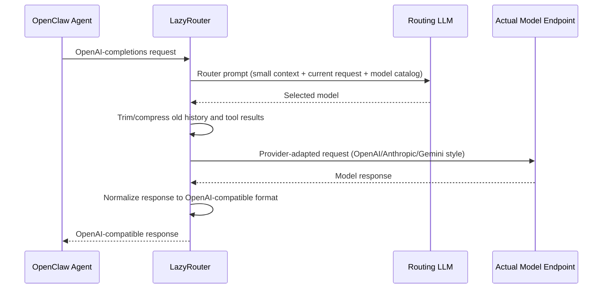

# LazyRouter

[English](README.md) | [Chinese](README_CN.md)

<p align="center">
  
</p>

LazyRouter is a fully self-hosted, OpenAI-compatible model router. Configure your own providers and models in YAML, send `model: "auto"`, and it routes requests to the best-fit model based on your policy.

## Why LazyRouter

1. Full self-hosted routing path: no extra routing SaaS in the middle, no extra per-request routing fee.
2. Provider and endpoint freedom: route across any OpenAI/Anthropic/Gemini style gateway by setting `base_url` + `api_style`.
3. Policy-driven cost/quality control: define your own model descriptions, prices, and Elo signals so routing matches your budget and quality bar.
4. Extra cost control in long sessions:
   - deterministic history compression (already implemented)
   - cache-aware model stickiness for Claude-style prompt caching in OpenClaw-style flows (already implemented)
   - deeper tool-schema trimming improvements (roadmap)

## Highlights

- OpenAI-compatible `POST /v1/chat/completions` (streaming + non-streaming)
- `auto` routing with router reasoning and model selection
- Provider-style handling for OpenAI, Anthropic, Gemini, and OpenAI-compatible endpoints
- Health-aware routing (`/v1/health-status`, `/v1/health-check`)
- Automatic fallback to Elo-similar models on retryable failures
- Cache-aware routing stickiness with `cache_ttl` + `cache_buffer_seconds`
- Tool-continuation optimization (`skip_router_on_tool_results`)
- Session reset support (`/new` or `/reset` clears routing/tool cache state)

## Quick Start

### Option 1: Run directly from GitHub (no clone)

Before running, download [`config.example.yaml`](https://raw.githubusercontent.com/mysteriousHerb/lazyrouter/main/config.example.yaml) as `config.yaml` and [`.env.example`](https://raw.githubusercontent.com/mysteriousHerb/lazyrouter/main/.env.example) as `.env`, then fill in your keys.

```bash
uvx --from git+https://github.com/mysteriousHerb/lazyrouter.git lazyrouter --config config.yaml --env-file .env
```

### Option 2: Clone and run locally

```bash
git clone https://github.com/mysteriousHerb/lazyrouter
cd lazyrouter
uv sync
cp config.example.yaml config.yaml
cp .env.example .env
uv run python main.py --config config.yaml
```

Server starts at `http://localhost:1234` (as configured in `config.example.yaml`).

## Config Notes (Non-Obvious Fields)

Use `config.example.yaml` as the baseline. Key details:

- `providers.*.api_style`:
  - `anthropic` and `gemini` use provider-specific adapters
  - anything else is treated as OpenAI-compatible (`openai`, `openai-completions`, `openai-responses`)
- `router.context_messages`: how much recent history the router model sees; higher can improve decisions but increases routing-token cost.
- `router.cache_buffer_seconds`: safety buffer before `cache_ttl` expiry to avoid near-expiry cache misses.
- `llms.<name>.cache_ttl`: enables cache-aware stickiness for that model (minutes). While cache is hot, LazyRouter avoids unnecessary downgrades to preserve cache hits.
- `context_compression.keep_recent_user_turns_in_chained_tool_calls`: protects very recent user turns during tool-result continuations.
- `context_compression.skip_router_on_tool_results`: reuses the last selected model on tool-result follow-up turns.
- `health_check.idle_after_seconds`: pauses background checks while idle to avoid wasting tokens.
- Elo values (`coding_elo`, `writing_elo`) also drive automatic fallback ordering — on retryable errors, LazyRouter picks the Elo-closest healthy model.

### Custom Router Prompt

You can override the router prompt:

```yaml
router:
  prompt: |
    You are a model router. Select the best model for the user's request.
    Available models: {model_descriptions}
    Context: {context}
    Current request: {current_request}
    Respond with reasoning and model choice.
```

Required placeholders: `{model_descriptions}`, `{context}`, `{current_request}`.

## OpenClaw Integration

Add LazyRouter as a provider in `.openclaw/openclaw.json`:

```json
{
  "models": {
    "providers": {
      "lazyrouter": {
        "baseUrl": "http://server-address:port/v1",
        "apiKey": "not-needed",
        "api": "openai-completions",
        "models": []
      }
    }
  }
}
```

Set primary model:

```json
{
  "agents": {
    "defaults": {
      "model": {
        "primary": "lazyrouter/auto"
      }
    }
  }
}
```

## Request Flow (OpenClaw -> LazyRouter -> Model -> OpenClaw)



Note: in some turns, router call can be skipped (single model config, tool-result continuation pinning, or hot cache stickiness).

### What Is Sent To The Routing LLM

LazyRouter sends one routing prompt message (`role: user`) to the router model. That prompt contains:

- `Available models`: each configured candidate model with description, optional Elo, and optional pricing.
- `Recent conversation context`: only a small recent window controlled by `router.context_messages` (not full history).
- `CURRENT USER REQUEST`: the latest user message text as the primary routing signal.

How context is kept small before routing:

- Only the last `context_messages - 1` prior conversation entries are included.
- User/assistant content is clipped to ~300 chars per line in router context.
- Tool results are summarized as one-liners like `[tool_name: 42L/3810ch]` instead of full raw output.
- Assistant tool-calls are represented by tool names only (for example: `assistant: called read_file, search_code`).

Conceptual router payload:

```json
{
  "messages": [
    {
      "role": "user",
      "content": "You are a model router...\n\nAvailable models:\n- gemini-2.5-flash: ... [coding_elo=..., input_price=...]\n- claude-opus: ...\n\nRecent conversation context:\nassistant: called read_file\ntool: [read_file: 42L/3810ch]\nuser: please fix the retry logic...\n\nCURRENT USER REQUEST (most important for routing):\nadd tests for fallback behavior"
    }
  ],
  "response_format": "json_schema(reasoning, model)"
}
```

## Example Request

```bash
curl -X POST http://localhost:1234/v1/chat/completions \
  -H "Content-Type: application/json" \
  -d '{
    "model": "auto",
    "messages": [{"role": "user", "content": "Explain vector databases briefly"}]
  }'
```

## API Endpoints

- `GET /health`
- `GET /v1/models` (also available as `GET /models`)
- `GET /v1/health-status`
- `GET /v1/health-check`
- `POST /v1/chat/completions`

## Positioning

Compared with [BlockRunAI/ClawRouter](https://github.com/BlockRunAI/ClawRouter) and [ulab-uiuc/LLMRouter](https://github.com/ulab-uiuc/LLMRouter): LLMRouter is a comprehensive research-oriented framework; LazyRouter focuses on a lean self-hosted runtime gateway with built-in multi-style endpoint adapters.

- lightweight self-hosted runtime routing (minimal ops footprint)
- custom provider endpoints and API styles in one service
- explicit routing economics (price + Elo + task fit)
- OpenClaw-oriented cache/session behavior (e.g. Claude prompt caching stickiness)

## Development

```bash
uv run python tests/test_setup.py
uv run pytest -q
```

## Documentation

- `docs/README.md`
- `docs/QUICKSTART.md`
- `docs/API_STYLES.md`
- `docs/QUICKSTART_API_STYLES.md`
- `docs/UV_GUIDE.md`

## License

GNU GENERAL PUBLIC LICENSE Version 3, 29 June 2007
