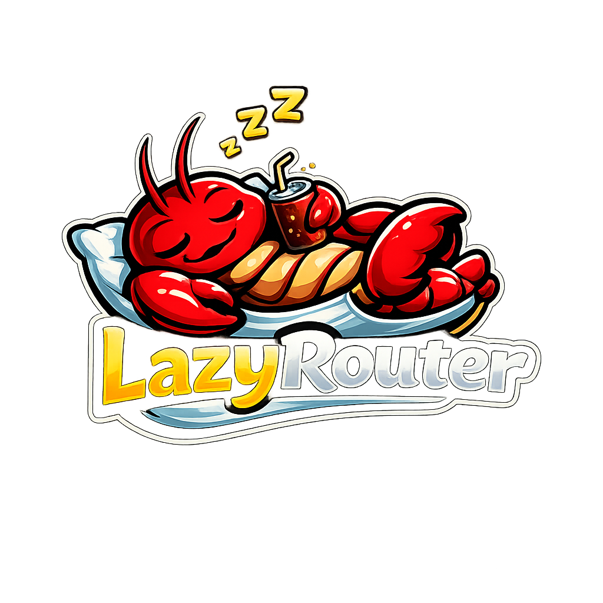

# LazyRouter

[English](README.md) | [中文](README_CN.md)

<p align="center">
  
</p>

LazyRouter is a lightweight OpenAI-compatible router that picks the best configured model for each request.

It is designed for simple operation: define providers/models in YAML, call `model: "auto"`, and let the router choose.

## Why This Exists

In agentic workflows, context grows quickly and token usage gets expensive.
Without smart routing, trivial prompts like "hi" or "hello" can still hit premium models (for example, Opus), which is not economical.

LazyRouter solves this by putting a cheap, fast router model in the middle as a gatekeeper:

- It chooses the right model for each request instead of always using the most expensive one.
- It reduces unnecessary spend in long-running agent sessions (especially OpenClaw-style workflows).
- It keeps a single OpenAI-compatible interface while handling provider differences behind the scenes.

It also helps translate behavior across API styles (OpenAI, Gemini, and Anthropic).

## Highlights

- OpenAI-compatible `/v1/chat/completions` endpoint
- LLM-based routing without extra training pipelines
- Mixed provider support in one config (OpenAI, Anthropic, Gemini, OpenAI-compatible gateways)
- Useful as a cost-control gatekeeper for agent frameworks like OpenClaw
- Built-in compatibility handling between OpenAI, Gemini, and Anthropic styles
- Streaming and non-streaming response support
- Health and benchmark endpoints for operational visibility
- Automatic model fallback on rate limits or errors (tries ELO-similar models)
- Exponential backoff retry when all models are temporarily unavailable

## Quick Start

### Option 1: Run directly from GitHub (no clone needed)

1. Install `uv`: <https://docs.astral.sh/uv/getting-started/installation/>
2. Create your config file (download [config.example.yaml](https://github.com/mysteriousHerb/lazyrouter/blob/main/config.example.yaml) as a starting point). You can put the API key in the config.yaml directly without the .env
3. Run:

```bash
uvx --from git+https://github.com/mysteriousHerb/lazyrouter.git lazyrouter --config config.yaml
```

If you want to use a specific env file path, add:

```bash
uvx --from git+https://github.com/mysteriousHerb/lazyrouter.git lazyrouter --config config.yaml --env-file .env
```

### Option 2: Clone and run locally

1. Install `uv`: <https://docs.astral.sh/uv/getting-started/installation/>
2. Clone the repo and install dependencies:

```bash
git clone https://github.com/mysteriousHerb/lazyrouter
cd lazyrouter
uv sync
cp .env.example .env
cp config.example.yaml config.yaml
```

3. Edit `.env` and `config.yaml` with your API keys, providers, and models.
4. Start the server:

```bash
uv run python main.py --config config.yaml
```

5. Send requests to `http://localhost:1234/v1/chat/completions`.

## Configuration

Use `config.example.yaml` as the base. API keys are loaded from `.env`.

- `coding_elo` / `writing_elo` in `llms` are quality signals you can source from `https://arena.ai/leaderboard`.
- `context_compression` controls how aggressively old history is trimmed to keep token usage/cost under control during long agent runs.

### Custom Routing Prompt

You can override the default routing prompt by adding a `prompt` field in the `router` section of your config:

```yaml
router:
  provider: gemini
  model: "gemini-2.5-flash"
  prompt: |
    You are a model router. Select the best model for the user's request.
    If the user explicitly requests a specific model, honor that request.
    Available models: {model_descriptions}
    Context: {context}
    Current request: {current_request}
    Respond with reasoning and model choice.
```

The prompt must include these placeholders: `{model_descriptions}`, `{context}`, and `{current_request}`.

### User-Directed Routing

The default routing prompt now supports explicit model requests from users. You can say things like:
- "Use opus for this task"
- "Route to gemini-2.5-pro"
- "Switch to claude-sonnet"

The router will honor these explicit requests and route to the specified model.


## OpenClaw Integration

Edit your `.openclaw/openclaw.json` and add a LazyRouter provider under `models.providers`:

```json
{
  "models": {
    "providers": {
      "lazyrouter": {
        "baseUrl": "http://server-address:port/v1",
        "apiKey": "not-needed",
        "api": "openai-completions",
        "models": []
      }
    }
  }
}
```

Then set your agent primary model to:

```json
 "agents": {
    "defaults": {
      "model": {
        "primary": "lazyrouter/auto"
      },
    }
  }
```


### Example Request

```bash
curl -X POST http://localhost:1234/v1/chat/completions \
  -H "Content-Type: application/json" \
  -d '{
    "model": "auto",
    "messages": [{"role": "user", "content": "Explain vector databases briefly"}]
  }'
```

## API Endpoints

- `GET /health` - Liveness check
- `GET /v1/models` - List available models
- `GET /v1/health-status` - Show cached health check results
- `GET /v1/health-check` - Run health check now and return results
- `POST /v1/chat/completions` - OpenAI-compatible chat endpoint

## Technical Implementation

LazyRouter uses a lightweight LLM-based routing architecture:

```text
┌─────────────────┐     ┌──────────────────┐     ┌──────────────────┐     ┌─────────────────┐
│  Client Request │────▶│  Router Model    │────▶│ Context Trimming │────▶│  LLM Provider   │
│  (model: auto)  │     │  (cheap & fast)  │     │  (token control) │     │  (via LiteLLM)  │
└─────────────────┘     └──────────────────┘     └──────────────────┘     └─────────────────┘
                               │                                                   │
                               │ selects best model                                │
                               ▼                                                   ▼
                        ┌──────────────────┐                              ┌─────────────────┐
                        │ OpenAI/Anthropic │                              │    Response     │
                        │ Gemini/Custom    │                              │   to Client     │
                        └──────────────────┘                              └─────────────────┘
```

Key components:

- **LLMRouter** (`router.py`): Uses a cheap/fast model (e.g., GPT-4o-mini, Gemini Flash) to analyze requests and select the optimal model based on Elo ratings, pricing, and task complexity. Returns structured JSON with reasoning.

- **FastAPI Server** (`server.py`): OpenAI-compatible `/v1/chat/completions` endpoint with streaming support. Handles provider-specific message sanitization for Gemini/Anthropic.

- **Context Compression** (`context_compressor.py`): Trims conversation history to control token usage in long agent sessions. Configurable via `max_history_tokens` and `keep_recent_exchanges`.

- **Health Checker** (`health_checker.py`): Background task that periodically pings models and excludes unhealthy ones from routing decisions.

- **Retry Handler** (`retry_handler.py`): Automatic fallback to ELO-similar models on rate limits or errors. Exponential backoff retry when all models fail, tied to health check interval.

- **Tool Cache** (`tool_cache.py`): Caches tool call IDs to model mappings per session, enabling router bypass on tool continuations for lower latency.

- **LiteLLM Integration**: All provider calls go through LiteLLM with `drop_params=True` for automatic compatibility handling across OpenAI, Anthropic, and Gemini APIs.

## Development

```bash
uv run python tests/test_setup.py
uv run pytest -q
```

## Documentation

- `docs/README.md` (docs index)
- `docs/QUICKSTART.md`
- `docs/API_STYLES.md`
- `docs/QUICKSTART_API_STYLES.md`
- `docs/UV_GUIDE.md`

## License
GNU GENERAL PUBLIC LICENSE Version 3, 29 June 2007
