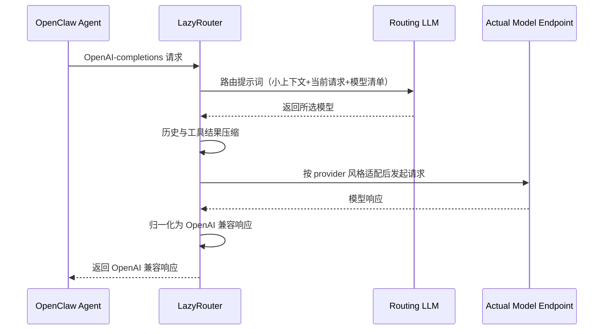

# 懒人路由 (LazyRouter)

[English](README.md) | [中文](README_CN.md)

<p align="center">
  
</p>

LazyRouter 是一个完全自托管、OpenAI 兼容的模型路由器。你只需要在 YAML 里配置 provider 和模型，发送 `model: "auto"`，它会按你的策略自动选择最合适的模型。

## 为什么选择 LazyRouter

1. 完全自托管的路由链路：中间没有额外路由 SaaS，也没有额外按请求收费。
2. Provider/Endpoint 自由：通过 `base_url` + `api_style`，可路由到 OpenAI、Anthropic、Gemini 或任意 OpenAI 兼容网关。
3. 策略驱动的成本与质量控制：你可以自行定义模型描述、价格和 Elo 信号，让路由符合你的预算和质量标准。
4. 长会话额外节省：
   - 确定性的历史压缩（已实现）
   - 面向 OpenClaw 场景的 Claude 风格缓存粘性路由（已实现）
   - 更深入的工具参数裁剪（规划中）

## 亮点

- OpenAI 兼容的 `POST /v1/chat/completions`（支持流式和非流式）
- `auto` 自动路由，并返回路由推理信息
- 支持 OpenAI、Anthropic、Gemini 及 OpenAI 兼容端点
- 健康检查感知路由（`/v1/health-status`、`/v1/health-check`）
- 可重试错误自动回退到 Elo 相近模型
- 基于 `cache_ttl` + `cache_buffer_seconds` 的缓存粘性路由
- 工具延续轮优化（`skip_router_on_tool_results`）
- 会话重置支持（`/new` 或 `/reset` 清理路由/工具缓存状态）

## 快速开始

### 方式一：直接从 GitHub 运行（无需克隆）

运行前，请先下载 [`config.example.yaml`](https://raw.githubusercontent.com/mysteriousHerb/lazyrouter/main/config.example.yaml) 并命名为 `config.yaml`，再下载 [`.env.example`](https://raw.githubusercontent.com/mysteriousHerb/lazyrouter/main/.env.example) 并命名为 `.env`，然后填入你的密钥。

```bash
uvx --from git+https://github.com/mysteriousHerb/lazyrouter.git lazyrouter --config config.yaml --env-file .env
```

### 方式二：克隆后本地运行

```bash
git clone https://github.com/mysteriousHerb/lazyrouter
cd lazyrouter
uv sync
cp config.example.yaml config.yaml
cp .env.example .env
uv run python main.py --config config.yaml
```

默认地址：`http://localhost:1234`（由 `config.example.yaml` 配置）

## 配置说明

以 `config.example.yaml` 为基准，重点如下：

- `providers.*.api_style`：
  - `anthropic` 和 `gemini` 会走对应适配逻辑
  - 其他值都按 OpenAI 兼容处理（如 `openai`、`openai-completions`、`openai-responses`）
- `router.context_messages`：路由模型可见的最近上下文条数。更高通常更准，但路由本身 token 开销也更高。
- `router.cache_buffer_seconds`：缓存 TTL 到期前的安全缓冲，避免临界时间点失去缓存命中。
- `llms.<name>.cache_ttl`：为该模型开启缓存感知粘性路由（分钟）。缓存处于热状态时，LazyRouter 会尽量避免不必要降级，以保留缓存命中。
- `context_compression.keep_recent_user_turns_in_chained_tool_calls`：工具链式调用时，保护最近若干用户轮不被压缩。
- `context_compression.skip_router_on_tool_results`：工具结果延续轮复用上次选中的模型。
- `health_check.idle_after_seconds`：空闲后暂停后台健康检查，避免无效 token 消耗。
- Elo 值（`coding_elo`、`writing_elo`）同时驱动自动回退排序——遇到可重试错误时，LazyRouter 会选择 Elo 最接近的健康模型。

### 自定义路由 Prompt

你可以覆盖默认路由提示词：

```yaml
router:
  prompt: |
    You are a model router. Select the best model for the user's request.
    Available models: {model_descriptions}
    Context: {context}
    Current request: {current_request}
    Respond with reasoning and model choice.
```

必须包含占位符：`{model_descriptions}`、`{context}`、`{current_request}`。

## OpenClaw 集成

在 `.openclaw/openclaw.json` 中添加 LazyRouter provider：

```json
{
  "models": {
    "providers": {
      "lazyrouter": {
        "baseUrl": "http://server-address:port/v1",
        "apiKey": "not-needed",
        "api": "openai-completions",
        "models": []
      }
    }
  }
}
```

把主模型设置为：

```json
{
  "agents": {
    "defaults": {
      "model": {
        "primary": "lazyrouter/auto"
      }
    }
  }
}
```

## 请求流转（OpenClaw -> LazyRouter -> 模型 -> OpenClaw）



注意：部分轮次会跳过路由器调用（例如仅配置了单模型、工具结果延续轮复用、缓存热状态粘性）。

### 路由 LLM 实际收到什么？

LazyRouter 会向路由模型发送一条路由消息（`role: user`），内容包含：

- `Available models`：候选模型描述、可选 Elo、可选价格信息。
- `Recent conversation context`：最近小窗口上下文（由 `router.context_messages` 控制，不是完整历史）。
- `CURRENT USER REQUEST`：最新用户输入，作为最主要路由信号。

在路由前如何保持小上下文：

- 仅保留最近 `context_messages - 1` 条历史上下文。
- 用户/助手文本在路由上下文中按每行约 300 字符截断。
- 工具结果会摘要为一行（如 `[tool_name: 42L/3810ch]`），而不是完整原始输出。
- 助手的工具调用只保留工具名（如 `assistant: called read_file, search_code`）。

概念化的路由请求载荷：

```json
{
  "messages": [
    {
      "role": "user",
      "content": "You are a model router...\n\nAvailable models:\n- gemini-2.5-flash: ... [coding_elo=..., input_price=...]\n- claude-opus: ...\n\nRecent conversation context:\nassistant: called read_file\ntool: [read_file: 42L/3810ch]\nuser: please fix the retry logic...\n\nCURRENT USER REQUEST (most important for routing):\nadd tests for fallback behavior"
    }
  ],
  "response_format": "json_schema(reasoning, model)"
}
```

## 请求示例

```bash
curl -X POST http://localhost:1234/v1/chat/completions \
  -H "Content-Type: application/json" \
  -d '{
    "model": "auto",
    "messages": [{"role": "user", "content": "简要解释向量数据库"}]
  }'
```

## API 端点

- `GET /health`
- `GET /v1/models`（也支持 `GET /models`）
- `GET /v1/health-status`
- `GET /v1/health-check`
- `POST /v1/chat/completions`

## 定位对比

相比 [BlockRunAI/ClawRouter](https://github.com/BlockRunAI/ClawRouter) 和 [ulab-uiuc/LLMRouter](https://github.com/ulab-uiuc/LLMRouter)：LLMRouter 更偏向”研究/评测型”的综合框架；LazyRouter 的定位是轻量级、自托管、可直接上线的运行时路由网关。

- 轻量级、自托管的在线运行时路由（运维负担更小）
- 在同一服务内桥接多种 endpoint/API 风格
- 可解释、可调的路由经济学（价格 + Elo + 任务匹配）
- 面向 OpenClaw 的缓存与会话行为优化（如 Claude prompt caching 粘性）

## 开发

```bash
uv run python tests/test_setup.py
uv run pytest -q
```

## 文档

- `docs/README.md`
- `docs/QUICKSTART.md`
- `docs/API_STYLES.md`
- `docs/QUICKSTART_API_STYLES.md`
- `docs/UV_GUIDE.md`

## 许可证

GNU GENERAL PUBLIC LICENSE Version 3, 29 June 2007
